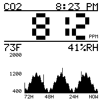

# CO2 monitor

ESP-IDF firmware for an ESP32-S3 SuperMini driving a Waveshare 1.54 inch
e-Paper Module V2 (200x200, SSD1681) and a DFRobot Gravity STCC4 CO2 sensor.
The display shows the current CO2 reading, time, temperature, and humidity,
plus a 72-hour CO2 history graph. An onboard RGB LED also reflects the
current CO2 level, based upon thresholds you set. Time comes from SNTP over Wi-Fi.



## Onboard RGB LED

Most ESP32-S3 SuperMini boards carry a single WS2812 addressable RGB LED.

`app_main` runs a background task that turns the LED into a CO2 status
indicator, based on the average CO2 reading over the past 2 minutes against
the `ELEVATED`/`ALERT`/`WARNING` ppm thresholds in `.env`:

| Condition | LED |
| --- | --- |
| Startup, before the first reading | solid blue |
| CO2 sensor not detected | flashing purple |
| Average above `WARNING` | flashing red |
| Average above `ALERT` | solid red |
| Average above `ELEVATED` | solid yellow |
| Otherwise | solid green |

## Hardware

- ESP32-S3 SuperMini (ESP32-S3FH4R2)
- Waveshare 1.54 inch e-Paper Module V2, 200x200, SSD1681 controller (comes
  with an 8-pin cable)
- DFRobot Gravity STCC4 CO2 sensor (SEN0678)

## Software

- [podman](https://podman.io) (or Docker) to compile in the `espressif/idf`
  container
- Python to run `esptool`/`esp-idf-monitor` on the host for flashing and
  monitoring

## Setup

- [docs/SETUP.md](docs/SETUP.md) (toolchain, configuration, build, flash)
- [docs/WIRING.md](docs/WIRING.md) (GPIO connections for the display, sensor, and RGB LED)

## Usage

Once the hardware is wired and `.env` is configured (see [docs/SETUP.md](docs/SETUP.md)), list the ports to find your device (probably /dev/tty.usbmodem...):

```bash
make ports
```

Specify the port where your device is connected:

```sh
make flash PORT=/dev/tty.usbmodem...
```

This builds and then writes to the board.

### Other targets

| Target | Effect |
| --- | --- |
| `make build` | Compile only, in the container |
| `make preview` | Render the display layout to `preview.bmp`, on this machine, no hardware needed |
| `make env` | Print what `.env` currently resolves to, without building |
| `make menuconfig` | ESP-IDF configuration UI, in the container |
| `make monitor` | Monitor the serial terminal |
| `make run` | Flash and then monitor the serial terminal |
| `make size` | Binary size breakdown |
| `make shell` | Interactive shell in the build container |
| `make erase` | Erase the entire flash (factory reset) |
| `make factory-reset` | Erase, then reflash |
| `make clean` | Remove build output |
| `make distclean` | Remove build output, `sdkconfig`, and the generated config header |
| `make ports` | List candidate serial devices |

## License

Apache License 2.0, see [LICENSE](LICENSE).
